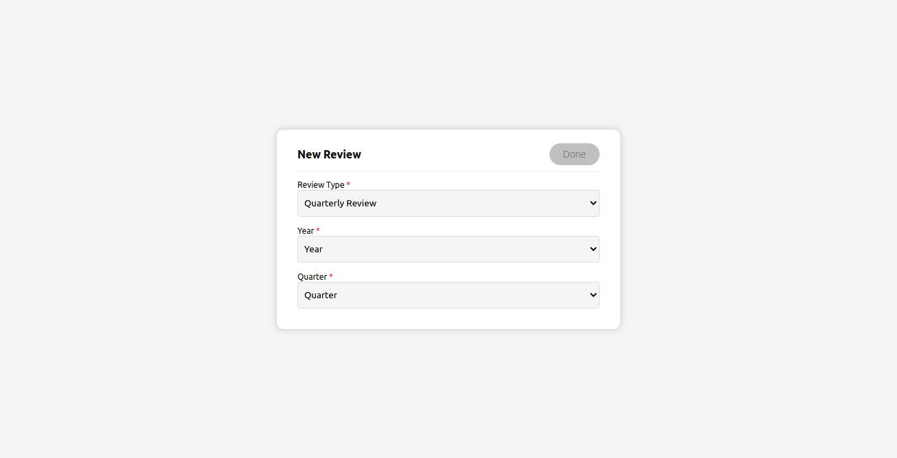

## Created using React
Fields are created based on the data provided in <code>src/data.json</code>.

On changing the form type, the fields are updated as well.

On form submission, the object is logged in the console.

